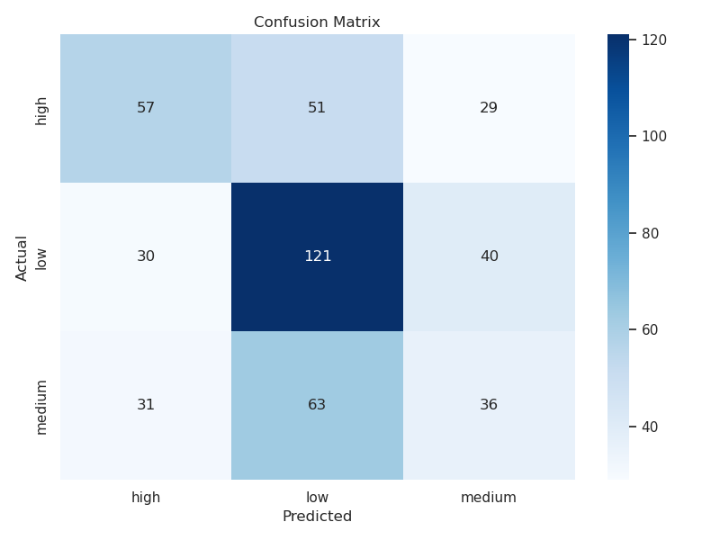

# 📌 Soical Media Popularity Prediction using Pinterest

This project explores the prediction of social media post popularity using **BERT-based embeddings** and a **neural network classifier**. The dataset consists of Pinterest posts labeled by popularity class (low, medium, high), & the model aims to predict the correct class based on post descriptions & engagement data.

---

## 📂 Project Structure

```
.
├── bert_feat_made.py              # Extracts BERT embeddings from descriptions
├── training_text.py               # Trains the popularity classifier
├── eval_and_stat_graphs.py        # Evaluates model and generates visualizations
├── running_bert.sh                # Shell script to run BERT job on itiger
├── run_trainm.sh                  # Shell script to run training job on itiger
├── run_eval.sh                    # Shell script to run evaluation job on itiger
├── pinterest_cleaned.csv          # Preprocessed dataset
├── predictions.csv                # Output predictions from the model
├── *.png                          # Graphs (loss, confusion matrix, performance)
└── final_project_env.yml          # Conda environment file
```

---

## 📊 Data

The dataset includes cleaned Pinterest post descriptions and their popularity classes, which was created by using thresholds on engagement metrics. Descriptions were embedded using the **DistilBERT** model.

- `pinterest_cleaned.csv` — Raw data with post text and labels  
- `predictions.csv` — Model output predictions on test data  

---

## 🧠 Method & Model

- **Embeddings**: Descriptions are encoded with `distilbert-base-uncased` using the `[CLS]` token’s hidden state.
- **Classifier**: A PyTorch feedforward network with:
  - Input layer = BERT dimension (768)
  - Hidden layer = 128 units + dropout
  - Output layer = 3-class softmax
- **Training**: The model is trained using cross-entropy loss for 100–200 epochs on GPU with early stopping potential.

---

## 📈 Evaluation

The model was evaluated using:
- **Precision**, **Accuracy**, **Recall**, **F1-score**
- Confusion matrix (heatmap & bar plot)
- Classification report (summary + per-class metrics)
- Training loss visualizations (line plot, histogram, & bar plot)

Examples:




**🎯Evaluation Summary:**

```
Accuracy: 0.4672

Macro Average:
  precision: 0.4469
  recall: 0.4422
  f1-score: 0.4405
  support: 458.0000

Weighted Average:
  precision: 0.4565
  recall: 0.4672
  f1-score: 0.4576
  support: 458.0000

📊Full Classification Report:
              precision    recall  f1-score   support
        high       0.48      0.42      0.45       137
         low       0.51      0.63      0.57       191
      medium       0.34      0.28      0.31       130

📉Confusion Matrix:
        high  low  medium
high      57   51      29
low       30  121      40
medium    31   63      36

Final Training Loss: 0.0808
Best Training Loss: 0.0676 (Epoch 173)
Standard Deviation of Training Loss: 0.2673
```

---

## 📦 Setup & Usage

```bash
# 1. Create and activate conda environment
conda env create -f final_project_env.yml
conda activate multimodal-popularity

# 2. Extract BERT features
python bert_feat_made.py

# 3. Train the classifier
python training_text.py

# 4. Evaluate model and generate graphs
python eval_and_stat_graphs.py
```

---

## 🏗️ Running on itiger

To run feature extraction on the itiger cluster:

```bash
sbatch running_bert.sh
```

Make sure all paths are correctly set inside `running_bert.sh` and the conda environment is activated properly in your script.

---

## 📚 References

- 📄 [Augmented Hypergraph Learning for Social Media Popularity Prediction](https://dl.acm.org/doi/10.1145/3637528.3672041)
- 🤗 [Hugging Face Transformers](https://huggingface.co/transformers/)
- 🐍 [PyTorch](https://pytorch.org/)
- 📊 [Pinterest Dataset](https://www.kaggle.com/datasets/oneliwickramasinghe/pinterest-snapshot-of-popularity-and-engagement)

---

## 💡 What We Learned

- BERT embeddings significantly improve text representation for classification.
- Popularity prediction is class-imbalanced; models tend to overfit to dominant classes.
- Post popularity is predictable but uneven. Low-popularity posts are easiest to identify. These posts often lack compelling content, so their descriptions are semantically consistent (and easier for the model to learn).
- Medium popularity posts are the hardest. They often blend features of both low and high categories. This “in-between” class lacks distinct patterns, making it difficult for models to learn reliably — a classic issue in imbalanced or fuzzy datasets.
- Text features (via BERT) are very informative. Even without image data, the model could learn popularity signals from text alone. This confirms that language & description quality matter a lot for engagement.
- Popularity isn't just about quantity; it's about language. Posts with similar repin numbers might differ dramatically in predicted class depending on how they're described. This matches insights from the Augmented Hypergraph paper, where semantic cues heavily influenced engagement outcomes.
- Class imbalance affects prediction confidence. The classifier seemed biased toward predicting the “low” class — because it's overrepresented in the dataset. This highlights the importance of balancing datasets or adjusting class weights
during training.